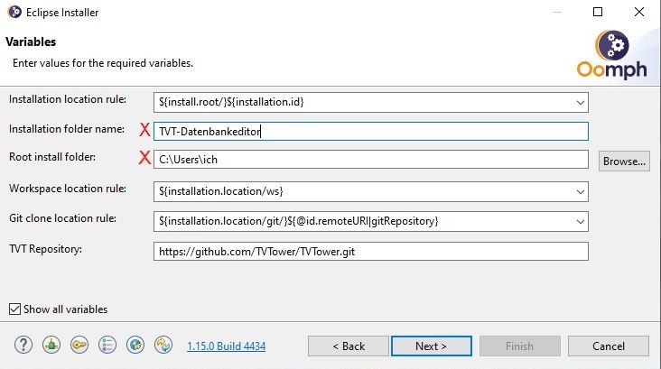

# Installation des TVTower-Datenbankeditors

In jedem Fall muss ein Java-Runtime installiert sein.

Ich empfehle die Verwendung des Eclipse-Installers zusammen mit dem vorbereiteten Projekt-Setup.
Damit wird immer das aktuellste Editor-Plugin verwendet und das Setup klont automatisch das TVTower-Repository und importiert die Datenbankdateien.

Es gibt allerdings auch ein fertig [zusammengebautes Eclipse](installation.md#vorgefertigtes-Eclipse) (ohne automatische Aktualisierung).

## mit Eclipse-Installer

1. [Eclipse-Installer](https://www.eclipse.org/downloads/) starten
1. in den "Advanced Mode" wechseln (falls rechs oben ein Menü mit drei Balken existiert, dieses anklicken und "Advanced Mode" wählen)
1. auf der Products-Seite die gewünschte Variante wählen
    * Eclipse Platform geht (Minimalinstallation), ich nehme meist Eclipse IDE for Java Developers
    * falls nur Java 8 installiert ist, muss man eine Version bis 2020-06 verwenden
    * Wer nicht noch andere Eclipse-Installationen vornehmen möchte, kann den Haken neben `Bundle Pool` entfernen (ist diese Option aktiviert, werden Plugins an zentraler Stelle gespeichert und müssen bei einer weiteren Installation nicht noch einmal heruntergeladen werden - die Installation geht viel dann viel schneller)
    * mit `Next` auf die Projects-Seite wechseln
1. auf der Projects-Seite
    * Grünes Plus oben rechts für das Hinzufügen eines neuen Setups anklicken (es geht der `Add User Projects`-Dialog auf)
    * Im Catalog-Dropdown `Github Projects` auswählen
    * `https://raw.githubusercontent.com/TVTower/TVTDatabaseEditor/master/TVTDbEditor.setup` in das Resource-URIs-Textfeld eintragen; mit `OK` abschließen
    * (bei einer nochmaligen Installation ist das Setup schon in der Liste und muss nicht noch einmal hinzugefügt werden)
    * den Eintrag `TVT Database Editor` unter `Github Projects` -> `<User>` selektieren (das Projekt sollte jetzt unten in der Tabelle auftauchen); mit `Next` fortfahren
1. Auf der Variablen-Seite (siehe Bild) muss man sich entscheiden, wohin die Installation erfolgt, wohin das Repository geklont wird etc.
    * Wählt man die "rules" wie im Beispiel, muss man nur (mit rotem X markiert) das Basisinstallationsverzeichnis und den Installationsnamen (Unterverzeichnis im Basisinstallationsverzeichnis) festlegen.
    * Workspace und Repository-Klon landen dann neben dem Eclipse im Installationsverzeichnis (und alles könnte dann zusammen durch Löschen des Basisinstallationsverzeichnisses entfernt werden).
    * mit `Next` und `Finish` abschließen
1. nun erfolgt die Installation und Eclipse wird gestartet
1. Unten rechts in der Eclipse-Statusleiste dreht sich ein kleines Update-Rädchen, das kann man Anklicken, um den Oomph-Installationsfortschritt zu verfolgen. Hier kann man den nötigen Eclipse-Neustart bestätigen.

Bei der Installation sollte das TVTower-Git-Repository geklont und ein Projekt mit den Datenbankdateien importiert worden sein.
Da die Datenbankdateien im Git-Repository liegen, kann man nun (entweder mit dem in Eclipse integrierten Egit oder einen beliebigen anderen Git-Client) die Datein versioniert bearbeiten.

## vorgefertigtes Eclipse

Das vorgefertigte Eclipse beinhaltet keinen Git-Client und keine automatiche Updatemöglichkeit.
Es wurde ein Projekt mit einem aktuellen Stand der Datenbankdateien integriert, damit man sofort loslegen kann.
* [Download Windows (64)](https://www.nittka.de/download/tvtdb-editor_win64.zip)

Um aktuellere Editor-Plugin-Versionen zu verwenden, müssen die jars
* `org.tvtower.db_<version>.jar`
* `org.tvtower.db.ui_<version>.jar`
* `org.tvtower.db.ide_<version>.jar`

in das plugins-Verzeichnis des Eclipse kopiert werden.
Die jars findet man z.B. in der `artifact.zip`, die von der Github-Action beim Bauen des Master-Branches erzeugt wurde.

## Updatesite

Zur Zeit wird der jeweils aktuelle Snapshot der Editor-Plugins unter `https://www.nittka.de/download/tvtdb` zur Verfügung gestellt.
Eine Updatesite für stabile Releases gibt es noch nicht.

Das dort verfügbare Editor-Feature sollte sich über den Update-Site-Mechanismus in ein Eclipse (möglichst eine Version für Java-Entwickler) installieren lassen (`Help`->`Install New Software` bei `Add` die obige URL eintragen).